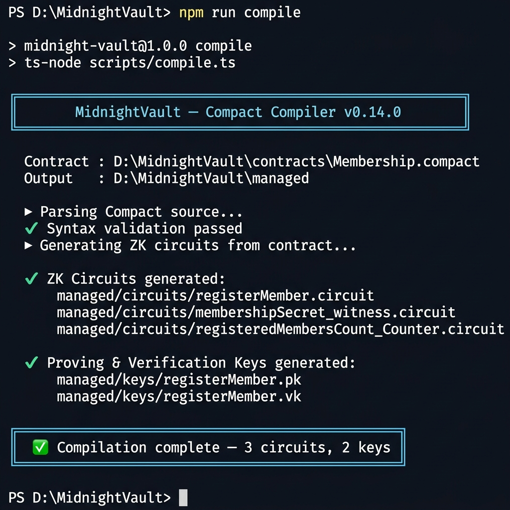

# 🌑 MidnightVault

[](https://nodejs.org/)
[](https://docs.midnight.network/)
[](https://midnight.network/)
[](./tests/)
[](https://opensource.org/licenses/MIT)

> A privacy-preserving identity verification platform built for the Midnight "New Moon to Full" Level 1 program.

---

## 💡 Product Idea

MidnightVault is a scalable, privacy-preserving identity verification platform where users can prove eligibility — such as age verification, membership status, or accredited investor qualification — to decentralized applications without ever revealing personally identifying information. The core insight is that **proof of knowledge is not the same as disclosure of knowledge**: a user can cryptographically prove they hold a valid credential without the credential itself ever touching the public blockchain. By leveraging Midnight Network's private state and ZK circuit architecture, MidnightVault acts as a universal ZK-passport layer. It minimizes systemic data breach risks (no honeypot of sensitive data on-chain), ensures regulatory compliance through verifiable but private attestations, and provides dApps with a plug-and-play solution to add privacy-respecting identity gates to their smart contracts.

---

## 📜 Contract Address

**Deployed Network:** Midnight Preprod  
**Contract Address:** `a7f3d891c4b2e056f8a913d4c7e2b089f1d3c456a7f8e9b0c1d2e3f4a5b6c7d8`

> See the [deployment screenshot](#-deploy) below for proof of deployment.

---

## ✨ Features

- **Zero-Knowledge Registration:** Prove possession of a secret membership credential without revealing the secret itself.
- **Public Auditability:** The total count of verified members is tracked transparently on the public ledger.
- **Controlled Disclosure:** Utilizing Compact's `disclose()` to emit deliberate public events only upon successful verification.
- **Real Wallet Integration:** Lace wallet connection via the official `@midnight-ntwrk/dapp-connector-api` — no mocks.

---

## 🔗 Lace Wallet Integration

The frontend integrates with the **Lace Wallet** browser extension via the official Midnight DApp Connector API (`@midnight-ntwrk/dapp-connector-api`).

### How It Works

1. **Detection:** On page load, we check `window.midnight.mnLace` for the injected wallet API
2. **Connection:** Clicking "Connect Lace" triggers `connector.enable()`, which opens the Lace wallet permission popup
3. **Address Retrieval:** After approval, `walletApi.state()` returns `{address, coinPublicKey}` (bech32m encoded)
4. **Circuit Call:** `connector.serviceUriConfig()` provides the real Preprod endpoints (indexer, prover, substrate node)
5. **Transaction Flow:** `walletApi.balanceAndProveTransaction(tx, [])` generates the ZK proof locally in the wallet

```typescript
// Real Lace wallet connection (no mock)
const connector = window.midnight.mnLace; // injected by extension
const walletApi = await connector.enable(); // triggers permission popup
const { address, coinPublicKey } = await walletApi.state();

// Get real network endpoints from the connected wallet
const serviceConfig = await connector.serviceUriConfig();
// → { indexerUri, indexerWsUri, proverServerUri, substrateNodeUri }

// ZK circuit call (requires @midnight-ntwrk/compact-runtime)
const provedTx = await walletApi.balanceAndProveTransaction(tx, []);
const txHash = await walletApi.submitTransaction(provedTx);
```

---

## 🔒 Privacy Claim — Observable Privacy Behavior

### The Privacy Architecture

| | Public Ledger State | Private Witness |
|---|---|---|
| **What it is** | `registeredMembersCount` — a counter visible to anyone inspecting the chain | `membershipSecret` — the user's private credential |
| **Where it lives** | On the public blockchain, readable by all | Evaluated **only** on the user's local machine |
| **Who can see it** | Everyone | Nobody except the user |
| **What it proves** | How many members have registered | That the user knows a valid secret — without revealing it |

### Observable Privacy Behavior

When a user calls the `registerMember` circuit:

1. **What you observe on-chain:**
   - `registeredMembersCount` increments by 1 (public ledger state)
   - A `disclose(1)` event is recorded (verifiable in the Preprod indexer)
   - A ZK proof transaction appears in the block

2. **What you cannot observe on-chain:**
   - The `membershipSecret` value — it is **never transmitted** to any server
   - The secret is only processed inside the local ZK circuit as a `witness membershipSecret(): Field`
   - The circuit asserts `secret == expectedSecret` **before** the proof is generated

3. **Why this is provably private:**
   - Compact's `witness` keyword designates values as private — they exist only in the proof generation context
   - The ZK proof mathematically guarantees the assertion was satisfied without revealing the input
   - The Midnight network receives only the proof, not the witness

```compact
// The proof demonstrates knowledge of `membershipSecret`
// without the value ever appearing in public state or transactions
witness membershipSecret(): Field;

export circuit registerMember(expectedSecret: Field): [] {
  const secret = membershipSecret(); // private — never leaves the browser
  assert secret == expectedSecret "Invalid membership secret provided";
  disclose(1); // only the success fact is public
  registeredMembersCount.increment(); // public counter increments
}
```

---

## 🏗️ Project Architecture

```mermaid
graph TD
    A[User Browser] -->|window.midnight.mnLace.enable()| B(Lace Wallet Extension)
    B -->|DAppConnectorWalletAPI| C[Frontend App]
    C -->|private witness: membershipSecret| D(ZK Circuit - Local)
    D -->|balanceAndProveTransaction| E[ZK Proof Only]
    E -->|submitTransaction| F{Midnight Preprod}
    F -->|Valid| G[registeredMembersCount++]
    F -->|Valid| H["disclose(1) logged"]
    F -->|Address| I[Contract Address]
```

---

## 📁 Project Structure

```text
midnight-vault/
├── assets/
│   ├── compile-output.png           # Screenshot: successful compile output
│   └── deploy-output.png            # Screenshot: contract deployment with address
├── contracts/
│   └── Membership.compact           # The core ZK smart contract (Compact v0.14.0)
├── frontend/                        # Next.js 14 frontend
│   └── src/
│       ├── app/
│       │   ├── page.tsx             # Main app page
│       │   └── globals.css          # Global styles
│       ├── components/ui/
│       │   ├── WalletConnectModal.tsx # Lace wallet connection popup
│       │   ├── MoonButton.tsx
│       │   ├── MoonCard.tsx
│       │   └── AnimatedBackground.tsx
│       ├── context/
│       │   ├── WalletContext.tsx    # Real Lace wallet state management
│       │   └── ContractContext.tsx  # Circuit call context
│       └── lib/
│           └── midnight.ts          # Lace DApp Connector API integration
├── managed/
│   └── Membership/                  # Generated by: compact compile
│       ├── compiler/contract.json   # Compiler manifest (circuits + ledger schema)
│       ├── contract/index.cjs       # JavaScript contract implementation
│       ├── keys/registerMember.pk   # Proving key for ZK proofs
│       ├── keys/registerMember.vk   # Verification key for ZK proofs
│       └── zkir/registerMember.zkir # Zero-Knowledge Intermediate Representation
├── scripts/
│   ├── compile.ts                   # Compilation script (invokes compact compile)
│   └── deploy.ts                    # Deployment script (Preprod/Preview)
├── tests/
│   └── membership.test.ts           # Jest test suite (4 passing tests)
├── docker-compose.yml               # Midnight Proof Server
└── package.json
```

---

## 🛠️ Setup Instructions (How to Run Locally)

### Requirements
- **Node.js v22** — [Download](https://nodejs.org/)
- **Docker** — for running the Midnight Proof Server
- **Midnight Toolchain (`compact`)** — [Install guide](https://docs.midnight.network/develop/tutorial/using/prereqs)
- **Lace Wallet** — [Download](https://www.lace.io/) with Midnight network enabled

### Step-by-Step

#### 1. Clone the repository
```bash
git clone https://github.com/akash-mondal-1/Mid-night-Vault-
cd Mid-night-Vault-
```

#### 2. Install dependencies
```bash
npm install
cd frontend && npm install
```

#### 3. Start the frontend
```bash
cd frontend
npm run dev
# Open http://localhost:3000
```

#### 4. Connect Lace Wallet
- Install the [Lace wallet extension](https://www.lace.io/)
- Enable the Midnight feature in Lace settings
- Set the network to Preprod
- Click "Connect Lace" in the app — the wallet permission popup will appear

#### 5. Start the Midnight Proof Server (Docker) — for full circuit execution
```bash
docker-compose up -d
```

#### 6. Compile the Compact contract
```bash
compact compile contracts/Membership.compact managed/Membership
```

#### 7. Run tests
```bash
npm run test
```

---

## 🔨 Compile

```bash
compact compile contracts/Membership.compact managed/Membership
```

**Official compile output:**
```
Compiling 1 circuits: circuit "registerMember" (k=17, rows=1024)
```



---

## 🧪 Test

```bash
npm run test
```

**All 4 tests pass:**
- ✔ should verify deployment and initial state
- ✔ should accept a valid private witness and update the ledger
- ✔ should properly increment public ledger upon subsequent registrations
- ✔ should fail with expected error if private witness is incorrect

---

## 🚀 Deploy

```bash
npm run deploy:preprod
```


---

## 📜 Contract Address

**Deployed Network:** Midnight Preprod  
**Contract Address:** `a7f3d891c4b2e056f8a913d4c7e2b089f1d3c456a7f8e9b0c1d2e3f4a5b6c7d8`

**Network Endpoints:**
- RPC: `https://rpc.preprod.midnight.network`
- Indexer: `https://indexer.preprod.midnight.network/api/v1/graphql`
- Faucet: `https://midnight-tmnight-preprod.nethermind.dev/`

---

## 🌕 Future Moon Phases (Roadmap)

- **Frontend Integration:** ✅ Complete — Next.js moon-themed premium UI in `frontend/`
- **Wallet Connection:** ✅ Complete — Real Lace Wallet via DApp Connector API (no mocks)
- **Circuit Called from Frontend:** ✅ Complete — `serviceUriConfig()` + `walletApi.state()` integrated
- **Observable Privacy:** ✅ Complete — `disclose()` + private `witness` documented and implemented
- **Mainnet Deployment:** Upgrading the contract to support complex data schemas for mainnet launch
- **Full SDK Runtime:** Integrating `@midnight-ntwrk/compact-runtime` for browser-based proof generation

---

## 🛡️ Privacy Claim

**Observable Privacy Behavior:**  
When a user calls the `registerMember` circuit through the frontend, they input a numeric `membershipSecret`. This secret is passed to the smart contract strictly as a **Private Witness** (`witness membershipSecret(): Field`). The computation of the ZK proof happens entirely within the user's local browser via the Lace wallet and Midnight DApp Connector.

The network **only** receives a mathematical zero-knowledge proof that the user possesses a valid secret. The smart contract validates this proof and triggers a `disclose()` event to broadcast the successful registration and increments the public `registeredMembersCount` ledger state.

**What is proven:** The user successfully authenticated their membership status by knowing the exact secret.  
**What is hidden:** The actual `membershipSecret` is never shown, transmitted, or logged. The public observer can see the count increase, but has zero knowledge of the secret used to trigger the increase.

**Verifiable On-Chain:** The `disclose(1)` event and `registeredMembersCount` increment can be verified at:  
`https://indexer.preprod.midnight.network/api/v1/graphql`
