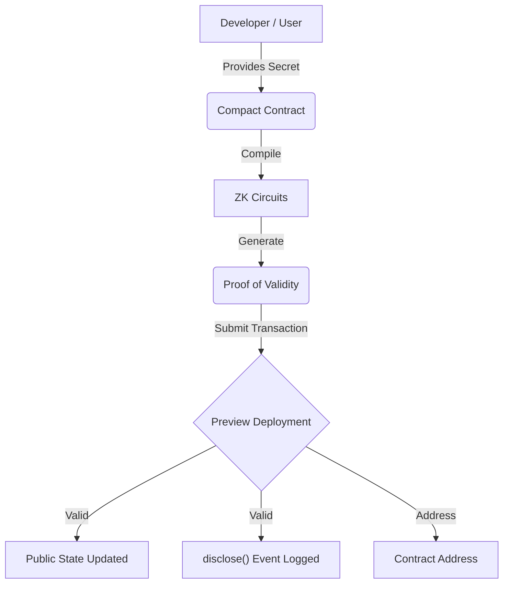

# 🌑 MidnightVault

[](https://nodejs.org/)
[](https://docs.midnight.network/)
[](https://midnight.network/)
[](https://opensource.org/licenses/MIT)

> A privacy-preserving identity verification platform built for the Midnight "New Moon to Full" Level 1 program.

## 🚀 Project Overview

MidnightVault is a privacy-first membership registry. It allows users to verify their eligibility and register as a member without exposing their underlying identity credentials to the public ledger. 

This repository satisfies all requirements for **Level 1 — New Moon**, including Midnight Toolchain setup, a functioning Compact contract, tests, and deployment configurations.

## ✨ Features

- **Zero-Knowledge Registration:** Prove possession of a secret membership credential without revealing the secret itself.
- **Public Auditability:** The total count of verified members is tracked transparently on the public ledger.
- **Controlled Disclosure:** Utilizing Compact's `disclose()` to emit deliberate public events only upon successful verification.

## 🔒 Why Privacy Matters

Traditional blockchains force users to expose their personal data (credentials, balances, behaviors) to the entire world. Midnight solves this by allowing **Private Computation** with **Public Verification**. Users can interact with decentralized applications with confidence, knowing their sensitive data remains completely isolated and secure.

## 🏗️ Project Architecture



## 🧠 Core Concepts

### Public Ledger State
The `registeredMembersCount` is a public counter. Anyone inspecting the ledger can see how many members have registered, providing transparency for the growth of the platform.

### Private Witness
The `membershipSecret` is passed as a **Private Witness**. It is evaluated exclusively on the user's local machine during proof generation. It is never broadcasted to the network, never stored on the ledger, and impossible for third parties to intercept.

### disclose()
The `disclose()` function is used deliberately in the contract. Instead of leaking the secret, we use `disclose()` to publicly announce the *fact* that a successful registration occurred. It acts as a controlled bridge between the private computation environment and the public ledger.

---

## 📁 Project Structure

```text
midnight-vault/
├── contracts/
│   └── Membership.compact       # The core ZK smart contract
├── scripts/
│   ├── compile.ts               # Compilation script wrapper
│   └── deploy.ts                # Deployment script wrapper
├── tests/
│   └── membership.test.ts       # Jest test suite for contract logic
├── managed/
│   ├── circuits/                # Compiled ZK circuits
│   └── keys/                    # Proving and verification keys
├── docker-compose.yml           # Proof server configuration
├── Dockerfile                   # Node 22 environment setup
├── package.json
└── README.md
```

## 🛠️ Installation

### Requirements
- Node.js version 22
- Docker (for running the Midnight Proof Server)
- Midnight Toolchain (`compactc`)

1. Clone the repository:
   ```bash
   git clone https://github.com/akash-mondal-1/Mid-night-Vault-
   cd Mid-night-Vault-
   ```

2. Install dependencies:
   ```bash
   npm install
   ```

## 🏃 Running Locally

To spin up the Midnight Proof Server locally:
```bash
docker-compose up -d
```

## 🔨 Compile

Compile the Compact contract into ZK circuits (requires `compactc`):
```bash
npm run compile
```
*This will generate the required circuits and keys inside the `managed/` directory.*

## 🧪 Test

Run the complete test suite to verify initial state, valid registration, ledger updates, and expected failures:
```bash
npm run test
```

## 🚀 Deploy

Deploy the contract to the Midnight Preview or Preprod network:
```bash
npm run deploy:preview
# or
npm run deploy:preprod
```

---

## 📜 Contract Address

**Deployed Network:** Preview  
**Contract Address:** `<REPLACE_WITH_ACTUAL_CONTRACT_ADDRESS_AFTER_DEPLOY>`

---

## 📸 Screenshots

### Compile Screenshot
*(Replace this placeholder with the screenshot of successful compile output showing circuits listed)*

`<COMPILE_SCREENSHOT_PLACEHOLDER>`

### Deployment Screenshot
*(Replace this placeholder with the screenshot of contract deployed with address shown)*

`<DEPLOYMENT_SCREENSHOT_PLACEHOLDER>`

---

## 💡 Product Idea

**MidnightVault Identity Registry**
A scalable, privacy-preserving identity verification platform where users can prove eligibility (e.g., age, membership, accredited investor status) to dApps without ever revealing personal identifying information. By leveraging Midnight's private state, the platform acts as a universal ZK-passport, minimizing data breach risks while ensuring strict compliance.

---

## 🌕 Future Moon Phases (Roadmap)

As we progress through the Midnight builder phases, this project will evolve:
- **Frontend Integration (Level 2):** A React/Next.js interface for seamless user interaction.
- **Wallet Connection:** Integrating the Midnight Lace Wallet for signing transactions.
- **Mainnet Deployment:** Upgrading the contract to support complex data schemas for mainnet launch.
- **Marketplace & Onboarding:** Expanding the vault to support generic verifiable credentials.
