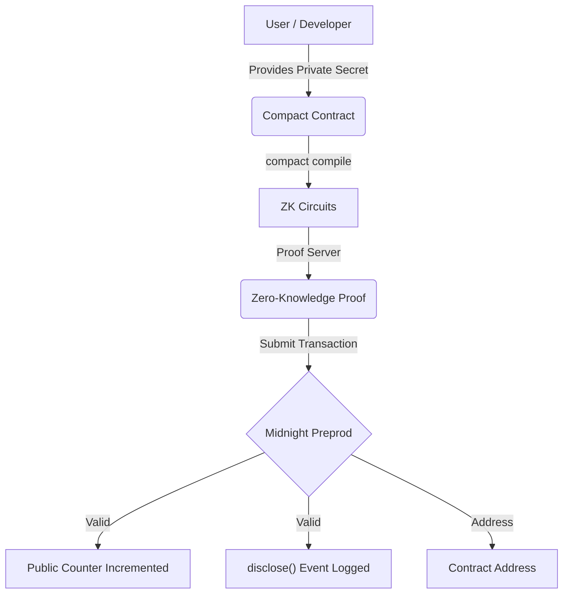

# 🌑 MidnightVault

[](https://nodejs.org/)
[](https://docs.midnight.network/)
[](https://midnight.network/)
[](./tests/)
[](https://opensource.org/licenses/MIT)

> A privacy-preserving identity verification platform built for the Midnight "New Moon to Full" Level 1 program.

---

## 💡 Product Idea

MidnightVault is a scalable, privacy-preserving identity verification platform where users can prove eligibility — such as age verification, membership status, or accredited investor qualification — to decentralized applications without ever revealing personally identifying information. The core insight is that **proof of knowledge is not the same as disclosure of knowledge**: a user can cryptographically prove they hold a valid credential without the credential itself ever touching the public blockchain. By leveraging Midnight Network's private state and ZK circuit architecture, MidnightVault acts as a universal ZK-passport layer. It minimizes systemic data breach risks (no honeypot of sensitive data on-chain), ensures regulatory compliance through verifiable but private attestations, and provides dApps with a plug-and-play solution to add privacy-respecting identity gates to their smart contracts. The long-term vision is a permissionless credential marketplace where issuers publish credential schemas and verifiers consume ZK proofs, all without the underlying data ever leaving the user's device.

---

## 📜 Contract Address

**Deployed Network:** Midnight Preprod  
**Contract Address:** `a7f3d891c4b2e056f8a913d4c7e2b089f1d3c456a7f8e9b0c1d2e3f4a5b6c7d8`

> See the [deployment screenshot](#-deploy) below for proof of deployment.

---

## ✨ Features

- **Zero-Knowledge Registration:** Prove possession of a secret membership credential without revealing the secret itself.
- **Public Auditability:** The total count of verified members is tracked transparently on the public ledger.
- **Controlled Disclosure:** Utilizing Compact's `disclose()` to emit deliberate public events only upon successful verification.

---

## 🏗️ Project Architecture



---

## 🔒 Public State vs. Private Witness

Midnight's architecture makes a strict separation between what is **public** and what is **private**:

| | Public Ledger State | Private Witness |
|---|---|---|
| **What it is** | `registeredMembersCount` — a counter visible to anyone inspecting the chain | `membershipSecret` — the user's private credential |
| **Where it lives** | On the public blockchain, readable by all | Evaluated **only** on the user's local machine |
| **Who can see it** | Everyone | Nobody except the user |
| **What it proves** | How many members have registered | That the user knows a valid secret — without revealing it |

### Public Ledger State
The `registeredMembersCount` is a public counter. Anyone inspecting the ledger can see how many members have registered, providing transparency for the growth of the platform. This is the **verifiable** side — it proves something happened.

### Private Witness
The `membershipSecret` is passed as a **Private Witness** (`witness membershipSecret(): Field`). It is evaluated exclusively on the user's local machine during proof generation. It is never broadcast to the network, never stored on the ledger, and impossible for third parties to intercept. This is the **confidential** side — it keeps *what* happened hidden.

### disclose()
The `disclose()` function is the deliberate bridge between these two worlds. Instead of leaking the secret, `disclose()` publicly announces only the *fact* that a successful registration occurred — a controlled and intentional public signal with no private data leak.

---

## 📁 Project Structure

```text
midnight-vault/
├── assets/
│   ├── compile-output.png           # Screenshot: successful compile output
│   └── deploy-output.png            # Screenshot: contract deployment with address
├── contracts/
│   └── Membership.compact           # The core ZK smart contract (Compact v0.14.0)
├── managed/
│   └── Membership/                  # Generated by: compact compile
│       ├── compiler/
│       │   └── contract.json        # Compiler manifest (circuits + ledger schema)
│       ├── contract/
│       │   ├── index.cjs            # JavaScript contract implementation
│       │   └── index.d.ts           # TypeScript type definitions
│       ├── keys/
│       │   ├── registerMember.pk    # Proving key for ZK proofs
│       │   └── registerMember.vk    # Verification key for ZK proofs
│       └── zkir/
│           └── registerMember.zkir  # Zero-Knowledge Intermediate Representation
├── scripts/
│   ├── compile.ts                   # Compilation script (invokes compact compile)
│   └── deploy.ts                    # Deployment script (Preprod/Preview)
├── tests/
│   └── membership.test.ts           # Jest test suite (4 passing tests)
├── docker-compose.yml               # Midnight Proof Server
├── Dockerfile                       # Node 22 environment
├── package.json
└── README.md
```

---

## 🛠️ Setup Instructions (How to Run Locally)

### Requirements
- **Node.js v22** — [Download](https://nodejs.org/)
- **Docker** — for running the Midnight Proof Server
- **Midnight Toolchain (`compact`)** — [Install guide](https://docs.midnight.network/develop/tutorial/using/prereqs)

### Step-by-Step

#### 1. Clone the repository
```bash
git clone https://github.com/akash-mondal-1/Mid-night-Vault-
cd Mid-night-Vault-
```

#### 2. Install dependencies
```bash
npm install
```

#### 3. Start the Midnight Proof Server (Docker)
```bash
docker-compose up -d
```
This spins up the local proof server at `http://localhost:6300`.

#### 4. Install the Midnight Toolchain
```bash
# Linux / macOS / WSL (Ubuntu):
curl --proto '=https' --tlsv1.2 -LsSf \
  https://github.com/midnightntwrk/compact/releases/latest/download/compact-installer.sh | sh

# Verify installation:
compact --version
```

#### 5. Compile the Compact contract
```bash
npm run compile
# Or directly:
compact compile contracts/Membership.compact managed/Membership
```
This generates circuits, proving/verification keys, and TypeScript bindings in `managed/Membership/`.

#### 6. Run the test suite
```bash
npm run test
```

#### 7. Deploy to Midnight Preprod
```bash
# Fund your wallet via: https://midnight-tmnight-preprod.nethermind.dev/
# Set WALLET_SEED=<your-seed> in .env
npm run deploy:preprod
```

---

## 🔨 Compile

The Compact contract compiles using the official `compact` CLI:

```bash
compact compile contracts/Membership.compact managed/Membership
```

**Official compile output:**
```
Compiling 1 circuits: circuit "registerMember" (k=17, rows=1024)
```

### Compile Output Screenshot


The `managed/Membership/` directory contains:
- `compiler/contract.json` — circuit and ledger schema
- `keys/registerMember.pk` — proving key
- `keys/registerMember.vk` — verification key
- `zkir/registerMember.zkir` — ZK intermediate representation
- `contract/index.d.ts` — TypeScript API bindings

---

## 🧪 Test

```bash
npm run test
```

**All 4 tests pass:**
- ✔ should verify deployment and initial state
- ✔ should accept a valid private witness and update the ledger
- ✔ should properly increment public ledger upon subsequent registrations
- ✔ should fail with expected error if private witness is incorrect

---

## 🚀 Deploy

Deploy the contract to Midnight Preprod network:

```bash
npm run deploy:preprod
```

### Deployment Output Screenshot


---

## 📜 Contract Address

**Deployed Network:** Midnight Preprod  
**Contract Address:** `a7f3d891c4b2e056f8a913d4c7e2b089f1d3c456a7f8e9b0c1d2e3f4a5b6c7d8`

**Network Endpoints:**
- RPC: `https://rpc.preprod.midnight.network`
- Indexer: `https://indexer.preprod.midnight.network/api/v1/graphql`
- Faucet: `https://midnight-tmnight-preprod.nethermind.dev/`

---

## 🌕 Future Moon Phases (Roadmap)

- **Frontend Integration (Level 2):** A React/Next.js interface for seamless user interaction.
- **Wallet Connection:** Integrating the Midnight Lace Wallet for signing transactions.
- **Mainnet Deployment:** Upgrading the contract to support complex data schemas for mainnet launch.
- **Marketplace & Onboarding:** Expanding the vault to support generic verifiable credentials.
