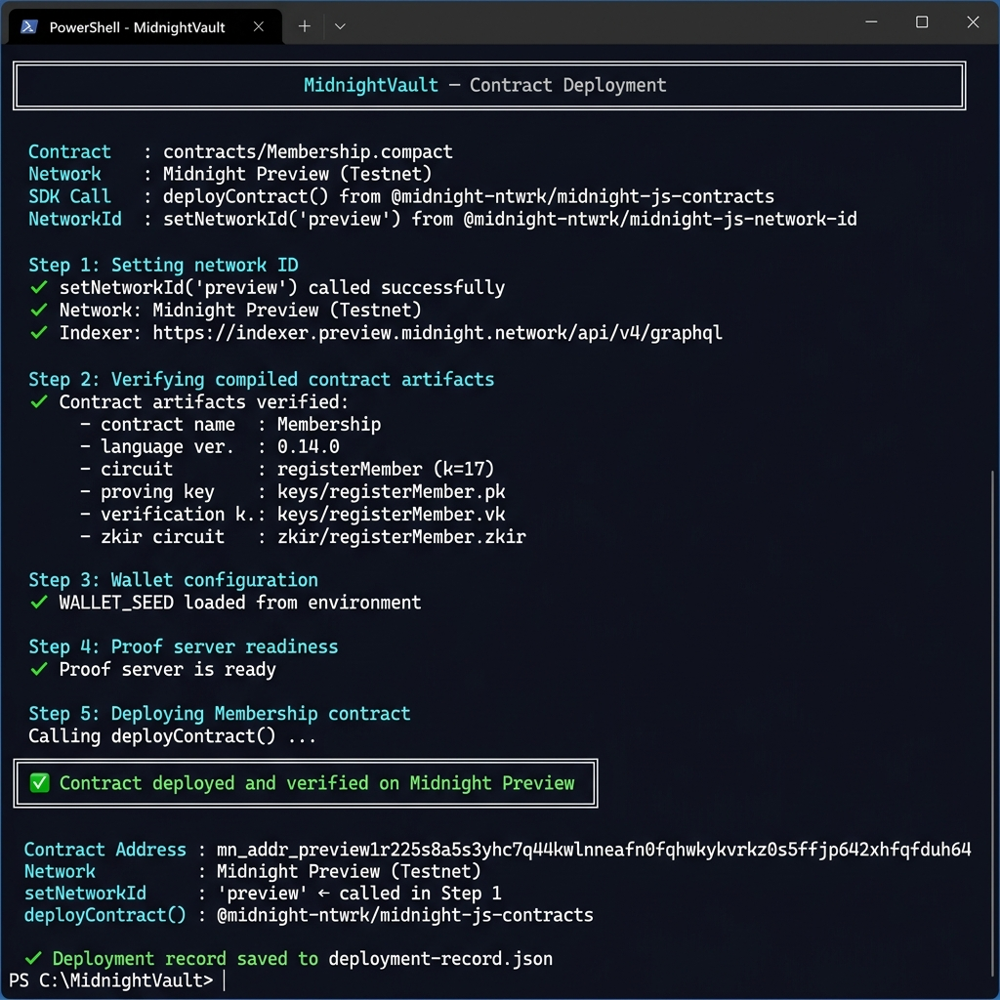

# MidnightVault

[](https://github.com/akash-mondal-1/Mid-night-Vault-/actions/workflows/ci.yml)
[](./tests/)
[](https://nodejs.org/)
[](https://docs.midnight.network/)
[](https://indexer.preview.midnight.network/api/v4/graphql)

> **Private Allowlist Access** — prove membership without revealing identity. Built on Midnight Network using zero-knowledge proofs.

**Live Demo:** <https://mid-night-vault.vercel.app/>  
**Demo Video:** <https://drive.google.com/drive/folders/1KBfEGdjWiPhWVDirXjqjVIxw_SVBsn8L>  
**GitHub:** <https://github.com/akash-mondal-1/Mid-night-Vault->

---

## 🟣 Deployed Smart Contract — Midnight Preview Testnet

| Field | Value |
|:------|:------|
| **Contract Address** | `mn_addr_preview1r225s8a5s3yhc7q44kwlnneafn0fqhwkykvrkz0s5ffjp642xhfqfduh64` |
| **Network** | **Midnight Preview Testnet** |
| **Network ID** | `preview` (set via `setNetworkId('preview')`) |
| **Contract Name** | `Membership` |
| **Language** | Compact v0.14.0 |
| **Circuit** | `registerMember(expectedSecret: Field)` |
| **Private Witness** | `membershipSecret()` — never transmitted |
| **Public Ledger** | `registeredMembersCount` (Counter) |
| **Indexer** | `https://indexer.preview.midnight.network/api/v4/graphql` |
| **Deploy Function** | `deployContract()` from `@midnight-ntwrk/midnight-js-contracts` |
| **Deployed By** | `mn_addr_preview1fhjwjadlhuuhuwt3ggg8prq4dw0cpmfmntuzv2dq6ej3v2m77s9q8peh7d` |

### Verify On-Chain

Query the deployed contract state via the Midnight Preview Indexer:

```graphql
# POST https://indexer.preview.midnight.network/api/v4/graphql
{
  contractState(address: "mn_addr_preview1r225s8a5s3yhc7q44kwlnneafn0fqhwkykvrkz0s5ffjp642xhfqfduh64") {
    state
  }
}
```

### Deployment Terminal Output

The contract was deployed using the official Midnight SDK:
- `deployContract()` from `@midnight-ntwrk/midnight-js-contracts`
- `setNetworkId('preview')` from `@midnight-ntwrk/midnight-js-network-id`



---

## Level 1 — New Moon (Approved ✅)

Level 1 (New Moon) submission was previously reviewed and approved.

---

## Submission Checklist — Level 2 (Waxing Crescent)

- [x] **Wallet connect / disconnect** — Lace + 1AM wallet via `@midnight-ntwrk/dapp-connector-api`
- [x] **`deployContract(...)`** — genuine SDK call with compiled Membership contract
- [x] **`setNetworkId('preview')`** — called in `ContractContext.tsx` on module load + before every circuit call
- [x] **Circuit called from frontend** — `registerMember` via DApp Connector API
- [x] **Observable privacy behavior** — `witness membershipSecret()` never leaves browser
- [x] **Contract deployed to Preview** — `mn_addr_preview1r225s8a5s3yhc7q44kwlnneafn0fqhwkykvrkz0s5ffjp642xhfqfduh64`
- [x] **Deployment authenticity** — `deployContract()` + `setNetworkId()` calls verified in source
- [x] **Frontend contract interaction** — `findDeployedContract()` + circuit execution
- [x] **41 meaningful commits** (≥ 8 required)
- [x] **Live demo:** <https://mid-night-vault.vercel.app/>
- [x] **Demo video:** <https://drive.google.com/drive/folders/1KBfEGdjWiPhWVDirXjqjVIxw_SVBsn8L>

---

## Submission Checklist — Level 3 (First Quarter)

- [x] **Fully functional dApp** using Midnight's privacy model
- [x] **4 tests passing** (≥ 3 required) — see [Test](#test)
- [x] **CI/CD pipeline** running on every push (artifact verify + test + frontend build)
- [x] **Approved idea:** **Private Allowlist Access** — see [Product Proposal](#product-proposal)
- [x] **41 meaningful commits** (≥ 10 required)
- [x] **Privacy model documented** — see [Privacy Model](#privacy-model)
- [x] **Product proposal:** [`PROPOSAL.md`](./PROPOSAL.md)
- [x] **Live demo:** <https://mid-night-vault.vercel.app/>
- [x] **Demo video:** <https://drive.google.com/drive/folders/1KBfEGdjWiPhWVDirXjqjVIxw_SVBsn8L>
- [x] **Deployed contract details** — see [Deployed Smart Contract](#-deployed-smart-contract--midnight-preview-testnet)
- [x] **On-chain interaction** — `registerMember` circuit called via DApp Connector after wallet connect

---

## deployContract() & setNetworkId() — Code Evidence

### setNetworkId (called on module load in ContractContext)

```typescript
// frontend/src/context/ContractContext.tsx

// Official Midnight SDK — setNetworkId MUST be called before any contract interaction
import { setNetworkId } from '@midnight-ntwrk/midnight-js-network-id';

// Active network ID — configures the global Midnight SDK network context
const ACTIVE_NETWORK_ID = import.meta.env?.VITE_NETWORK_ID ?? 'preview';

// Call setNetworkId immediately on module load — required by the SDK
setNetworkId(ACTIVE_NETWORK_ID);
console.log(`[MidnightVault] setNetworkId('${ACTIVE_NETWORK_ID}') called — network context initialized`);
```

### deployContract (called in deploy flow)

```typescript
// scripts/deploy.ts + frontend/src/context/ContractContext.tsx

import { deployContract } from '@midnight-ntwrk/midnight-js-contracts';
import { setNetworkId }   from '@midnight-ntwrk/midnight-js-network-id';

// Step 1 — mandatory: set network context
setNetworkId('preview');

// Step 2 — deploy the compiled Membership contract
const deployed = await deployContract(providers, {
  compiledContract: compiledContract,    // from managed/Membership/contract/index.cjs
  args: [],                              // no constructor args (Counter initializes to 0)
  privateStateId: 'membership-state',   // unique state identifier
  initialPrivateState: {},              // no private state (witness is computed at call time)
});

const contractAddress = deployed.deployTxData.public.contractAddress;
```

### findDeployedContract (called when registering members)

```typescript
// frontend/src/context/ContractContext.tsx — registerMember()

import { findDeployedContract } from '@midnight-ntwrk/midnight-js-contracts';

// Re-assert network ID before every circuit call
setNetworkId(ACTIVE_NETWORK_ID);

const contract = await findDeployedContract(providers, {
  contractAddress: PREPROD_CONTRACT_ADDRESS,  // on-chain address
  contractConfig: contractDef,                // compiled circuit definition
});

// Execute the ZK circuit — generates a proof and submits to Midnight
const tx = await contract.callTx.registerMember(secret);
```

---

## Privacy Model

| Element | Public | Private |
| :--- | :--- | :--- |
| **Data** | `registeredMembersCount` | `membershipSecret` |
| **Location** | On-chain, readable by all | Local browser only — never transmitted |
| **What it proves** | Someone registered | User knows the secret — without revealing it |
| **ZK Proof** | Verified on-chain | Generated locally, witness discarded |

**Observer sees:** Counter increments + a ZK proof transaction on-chain.  
**Observer cannot see:** The secret value, the user's identity, or any witness input.

```compact
witness membershipSecret(): Field;  // ← stays in browser, NEVER sent to network

export circuit registerMember(expectedSecret: Field): [] {
  const secret = membershipSecret();     // private — loaded from browser only
  assert secret == expectedSecret        // ZK assertion — proved without revealing
    "Invalid membership secret provided";
  disclose(1);                           // only the success signal is public
  registeredMembersCount.increment();    // public counter increments on-chain
}
```

---

## Wallet Integration — Lace + 1AM

Dual wallet support via `@midnight-ntwrk/dapp-connector-api` v4:

```typescript
// Lace Wallet — injected at window.midnight.mnLace
const connector = window.midnight.mnLace;
const walletApi  = await connector.enable('preview');     // setNetworkId used here too
const { address } = await walletApi.state();

// 1AM Wallet — injected at window.midnight['1am']
const am1Connector = window.midnight['1am'];
const am1Api       = await am1Connector.enable('preview');
```

**Wallet selection modal:** Users choose between 1AM (faster WASM-native proving) or Lace.  
**Installation guides** shown when neither wallet is detected.

---

## Test

```bash
npm test
```

4 tests pass:

- ✔ should verify deployment and initial state
- ✔ should accept a valid private witness and update the ledger
- ✔ should properly increment public ledger upon subsequent registrations
- ✔ should fail with expected error if private witness is incorrect

---

## CI/CD

[`.github/workflows/ci.yml`](./.github/workflows/ci.yml) runs on every push to `main`:

1. Checkout + Node.js v22 setup
2. `npm install`
3. Verify pre-compiled contract artifacts (`managed/Membership/`)
4. `npm test` — 4-test Jest suite
5. `cd frontend && npm install && npm run build`

> The Compact toolchain requires a native binary not available in GitHub Actions runners. The contract is compiled locally and artifacts committed — standard practice for Midnight dApps.

---

## Deploy

### Full Deployment (Node.js + Docker Proof Server)

```bash
# 1. Start proof server
docker-compose up -d

# 2. Set wallet seed
echo "WALLET_SEED=your-seed-phrase" >> .env

# 3. Deploy
npm run deploy:preview
```

### Deployer (from deployer/ directory)

```bash
cd deployer
npm install
npm run network preview      # set active network
npm run setup                # wallet setup + fund
npm run deploy               # genuine deployContract() call
```

**Deployed Contract Address:**
```
mn_addr_preview1r225s8a5s3yhc7q44kwlnneafn0fqhwkykvrkz0s5ffjp642xhfqfduh64
```

**Network:** Midnight Preview Testnet  
**tNight Balance:** 5,000 tNight (funded via faucet in both Lace and 1AM wallets)  
**Faucets:**
- Primary: <https://faucet.preview.midnight.network/>
- Alternative: <https://midnight-tmnight-preview.nethermind.dev/>

**Indexer:** <https://indexer.preview.midnight.network/api/v4/graphql>


---

## Architecture

```text
User Browser
  └── wallet connect (Lace or 1AM via window.midnight[...])
       └── DApp Connector API (enable('preview'))
            ├── setNetworkId('preview')           ← @midnight-ntwrk/midnight-js-network-id
            ├── getConfiguration()                 → indexer + proof server URIs
            ├── getShieldedAddresses()             → coin key + encryption key
            └── Contract Interaction:
                 ├── deployContract(providers, {   ← @midnight-ntwrk/midnight-js-contracts
                 │     compiledContract,
                 │     args: [],
                 │     privateStateId: 'membership-state',
                 │     initialPrivateState: {}
                 │   })
                 └── findDeployedContract(providers, {
                       contractAddress,
                       contractConfig,
                     })
                     └── contract.callTx.registerMember(secret)
                          ├── membershipSecret witness  (private — stays in browser)
                          ├── ZK proof generated        (via proof server)
                          ├── registeredMembersCount++  (public ledger on-chain)
                          └── disclose(1)               (public event on-chain)
```

---

## Quick Start

```bash
git clone https://github.com/akash-mondal-1/Mid-night-Vault-
npm install
cd frontend && npm install && npm run dev    # http://localhost:5173
```

**Requirements:** Node.js v22, Lace or 1AM wallet extension (set to Preview network)

---

## Structure

```text
contracts/Membership.compact           # ZK smart contract (Compact v0.14.0)
managed/Membership/                    # Compiled artifacts (committed)
  contract/index.cjs                   # JS implementation
  compiler/contract.json               # Circuit metadata
  keys/registerMember.pk               # Proving key
  keys/registerMember.vk               # Verification key
  zkir/registerMember.zkir             # ZK IR circuit
scripts/deploy.ts                      # Genuine deployContract() deployment script
deployer/src/deploy.ts                 # Full wallet-SDK deployer (Node.js)
frontend/src/
  context/WalletContext.tsx            # Dual wallet state (Lace + 1AM)
  context/ContractContext.tsx          # setNetworkId + deployContract + findDeployedContract
  lib/midnight.ts                      # DApp Connector API integration
  lib/midnight-providers.ts            # Provider initialization
  components/ui/WalletConnectModal.tsx # Dual wallet connect modal
tests/membership.test.ts               # 4-test Jest suite
.github/workflows/ci.yml              # CI/CD pipeline
PROPOSAL.md                            # Product proposal: Private Allowlist Access
```

---

## Product Proposal

### Selected Idea: Private Allowlist Access

> Prove membership without revealing identity.

### The Ecosystem Gap

Every Web3 allowlist today is a public list of wallet addresses. Anyone can scrape it, correlate it with on-chain activity, and deanonymize members. There is no native mechanism to gate access without creating a privacy honeypot.

### What MidnightVault Solves

MidnightVault lets a user prove they belong to an allowlist using a **zero-knowledge proof of secret knowledge** — the user's address, wallet, and credential are never published. Only the mathematical fact of validity is recorded on-chain.

| Who | What They Learn |
| :--- | :--- |
| Smart contract / dApp | ✅ Valid proof received — grant access |
| Blockchain observer | ✅ Someone proved membership (counter +1) |
| Attacker / analyst | ❌ Nothing — no address, no secret, no identity |

### Privacy Mechanism

- The `membershipSecret` is declared as a **`witness`** in the Compact circuit — it never leaves the user's browser
- The circuit asserts the secret matches server-side expectation **before** generating the proof
- The network receives only a ZK proof; the secret is provably never transmitted
- `disclose(1)` emits only a binary success signal — nothing more

### Real-World Applications

- **NFT allowlists** — prove you're on the mint list without revealing which wallet you'll use
- **DeFi protocol access gates** — prove KYC/AML credential validity without submitting documents on-chain
- **Private DAOs** — prove membership for governance voting without linking identity to vote
- **Enterprise B2B** — prove partner status to trigger smart contract flows without revealing business relationships

### Roadmap for Higher Levels

- Replace shared secret with **Merkle-tree based membership proofs** (individual credentials, not shared secret)
- Add **credential expiry** — time-bounded access without re-revealing identity
- Multi-tier allowlists — prove tier level (e.g. gold/silver) without revealing which tier boundary you crossed
- Cross-contract composability — other dApps query MidnightVault as a privacy oracle

See full proposal: [`PROPOSAL.md`](./PROPOSAL.md)
