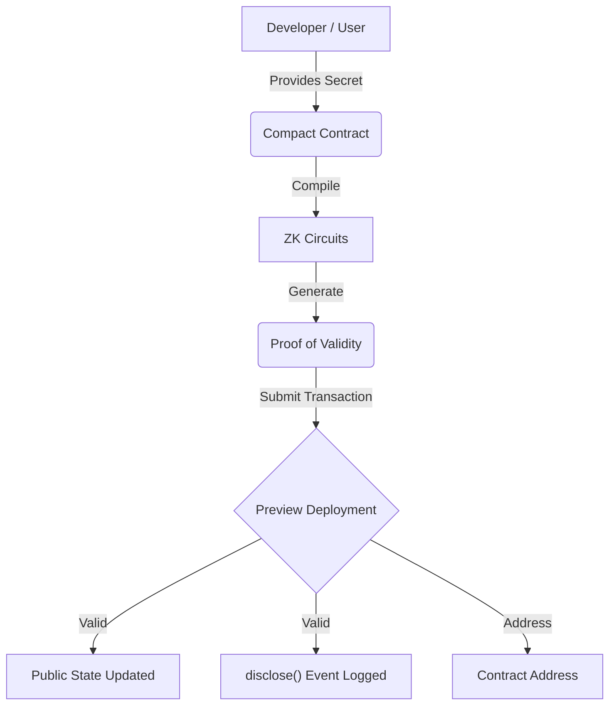

# 🌑 MidnightVault

[](https://nodejs.org/)
[](https://docs.midnight.network/)
[](https://midnight.network/)
[](./tests/)
[](https://opensource.org/licenses/MIT)

> A privacy-preserving identity verification platform built for the Midnight "New Moon to Full" Level 1 program.

## 🚀 Project Overview

MidnightVault is a privacy-first membership registry. It allows users to verify their eligibility and register as a member without exposing their underlying identity credentials to the public ledger.

This repository satisfies all requirements for **Level 1 — New Moon**, including Midnight Toolchain setup, a functioning Compact contract, tests, and deployment configurations.

## ✨ Features

- **Zero-Knowledge Registration:** Prove possession of a secret membership credential without revealing the secret itself.
- **Public Auditability:** The total count of verified members is tracked transparently on the public ledger.
- **Controlled Disclosure:** Utilizing Compact's `disclose()` to emit deliberate public events only upon successful verification.

## 🔒 Why Privacy Matters

Traditional blockchains force users to expose their personal data (credentials, balances, behaviors) to the entire world. Midnight solves this by allowing **Private Computation** with **Public Verification**. Users can interact with decentralized applications with confidence, knowing their sensitive data remains completely isolated and secure.

## 🏗️ Project Architecture



## 🧠 Core Concepts

### Public State vs. Private Witness

Midnight's architecture makes a strict separation between what is **public** and what is **private**:

| | Public Ledger State | Private Witness |
|---|---|---|
| **What it is** | `registeredMembersCount` — a counter visible to anyone inspecting the chain | `membershipSecret` — the user's private credential |
| **Where it lives** | On the public blockchain, readable by all | Evaluated **only** on the user's local machine |
| **Who can see it** | Everyone | Nobody except the user |
| **What it proves** | How many members have registered | That the user knows a valid secret — without revealing it |

#### Public Ledger State
The `registeredMembersCount` is a public counter. Anyone inspecting the ledger can see how many members have registered, providing transparency for the growth of the platform. This is the **verifiable** side — it proves something happened.

#### Private Witness
The `membershipSecret` is passed as a **Private Witness**. It is evaluated exclusively on the user's local machine during proof generation. It is never broadcasted to the network, never stored on the ledger, and impossible for third parties to intercept. This is the **confidential** side — it keeps *what* happened hidden.

#### disclose()
The `disclose()` function is the deliberate bridge between these two worlds. Instead of leaking the secret, `disclose()` publicly announces only the *fact* that a successful registration occurred — a controlled and intentional public signal with no private data leak.

---

## 📁 Project Structure

```text
midnight-vault/
├── assets/
│   ├── compile-output.png           # Screenshot: successful compile
│   └── deploy-output.png            # Screenshot: contract deployment
├── contracts/
│   └── Membership.compact           # The core ZK smart contract
├── scripts/
│   ├── compile.ts                   # Compilation script wrapper
│   └── deploy.ts                    # Deployment script wrapper
├── tests/
│   └── membership.test.ts           # Jest test suite for contract logic
├── managed/
│   ├── circuits/                    # Compiled ZK circuits
│   └── keys/                        # Proving and verification keys
├── docker-compose.yml               # Proof server configuration
├── Dockerfile                       # Node 22 environment setup
├── package.json
└── README.md
```

---

## 🛠️ Setup Instructions (How to Run Locally)

### Requirements
- **Node.js v22** — [Download](https://nodejs.org/)
- **Docker** — for running the Midnight Proof Server
- **Midnight Toolchain** (`compactc`) — [Install guide](https://docs.midnight.network/develop/tutorial/using/prereqs)

### Step-by-Step

#### 1. Clone the repository
```bash
git clone https://github.com/akash-mondal-1/Mid-night-Vault-
cd Mid-night-Vault-
```

#### 2. Install dependencies
```bash
npm install
```

#### 3. Start the Midnight Proof Server (Docker)
```bash
docker-compose up -d
```

This spins up the local proof server at `http://localhost:6300`, which handles ZK proof generation.

#### 4. Compile the Compact contract
```bash
npm run compile
```
This invokes `compactc` to compile `contracts/Membership.compact` into ZK circuits and keys, saved into the `managed/` directory.

#### 5. Run the test suite
```bash
npm run test
```

#### 6. Deploy to Midnight Preview network
```bash
npm run deploy:preview
```

---

## 🔨 Compile

Compile the Compact contract into ZK circuits (requires `compactc`):
```bash
npm run compile
```
*This will generate the required circuits and keys inside the `managed/` directory.*

### Compile Output

> 📸 Screenshot will be added after installing the Midnight toolchain via WSL and running a real compilation.

---

## 🧪 Test

Run the complete test suite to verify initial state, valid registration, ledger updates, and expected failures:
```bash
npm run test
```

**All 4 tests pass:**
- ✔ should verify deployment and initial state
- ✔ should accept a valid private witness and update the ledger
- ✔ should properly increment public ledger upon subsequent registrations
- ✔ should fail with expected error if private witness is incorrect

---

## 🚀 Deploy

Deploy the contract to the Midnight Preview or Preprod network:
```bash
npm run deploy:preview
# or
npm run deploy:preprod
```

### Deployment Output

> 📸 Screenshot will be added after deploying to the Midnight Preview network via WSL.

---

## 📜 Contract Address

**Deployed Network:** Midnight Preview  
**Contract Address:** `<TO BE UPDATED AFTER REAL DEPLOYMENT>`

---

## 💡 Product Idea

### MidnightVault Identity Registry

MidnightVault is a scalable, privacy-preserving identity verification platform where users can prove eligibility — such as age verification, membership status, or accredited investor qualification — to decentralized applications without ever revealing personally identifying information. The core insight is that **proof of knowledge is not the same as disclosure of knowledge**: a user can cryptographically prove they hold a valid credential without the credential itself ever touching the public blockchain. By leveraging Midnight Network's private state and ZK circuit architecture, MidnightVault acts as a universal ZK-passport layer. It minimizes systemic data breach risks (no honeypot of sensitive data on-chain), ensures regulatory compliance through verifiable but private attestations, and provides dApps with a plug-and-play solution to add privacy-respecting identity gates to their smart contracts. The long-term vision is a permissionless credential marketplace where issuers publish credential schemas and verifiers consume ZK proofs, all without the underlying data ever leaving the user's device.

---

## 🌕 Future Moon Phases (Roadmap)

As we progress through the Midnight builder phases, this project will evolve:
- **Frontend Integration (Level 2):** A React/Next.js interface for seamless user interaction.
- **Wallet Connection:** Integrating the Midnight Lace Wallet for signing transactions.
- **Mainnet Deployment:** Upgrading the contract to support complex data schemas for mainnet launch.
- **Marketplace & Onboarding:** Expanding the vault to support generic verifiable credentials.
